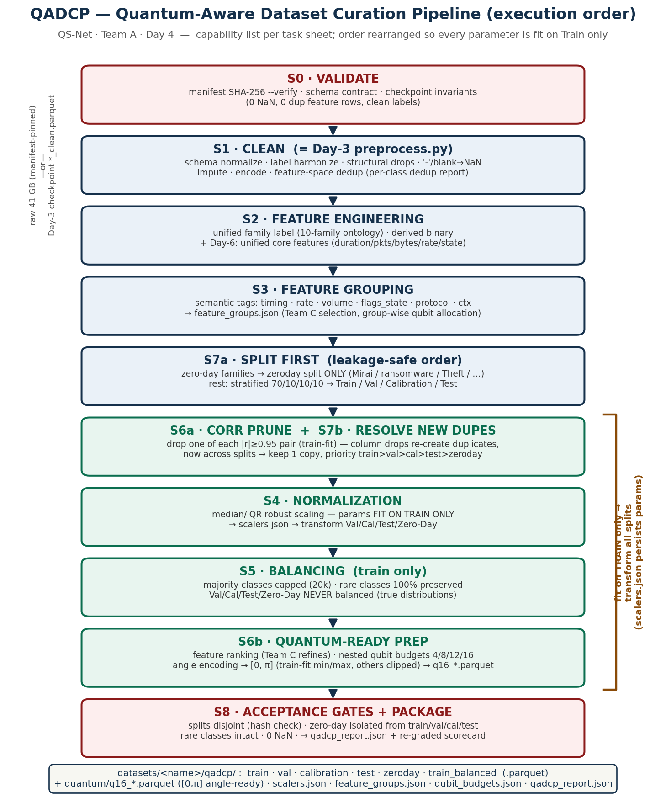

# Deliverable (Day 4) — QADCP Design: Workflow Diagram & Implementation

**Final QADCP — Week 1** (handover: [`14_handover_report.md`](14_handover_report.md)).

**QS-Net / QuantumSentinel — Team A** · Week 1 · Day 4.
Task (`first 7 days task.pdf`): *design the Quantum-Aware Dataset Curation Pipeline (QADCP) covering
data validation, cleaning, feature engineering, feature grouping, normalization, balancing,
quantum-ready preparation, and dataset splitting → QADCP workflow diagram and implementation.*
Implementation: [`scripts/qadcp.py`](../scripts/qadcp.py) (deterministic, seed 42) ·
Diagram: [`figures/qadcp_workflow.png`](figures/qadcp_workflow.png)
(regenerate: [`scripts/make_qadcp_diagram.py`](../scripts/make_qadcp_diagram.py)).
Evidence base: every stage below is motivated by a **measured flaw** from Days 1–3
([`00`](00_findings_and_flaws.md) §5, [`04`](04_eda_report.md) R1–R6, [`05`](05_data_quality_report.md)
flaw register, [`07`](07_preprocessing_pipeline.md) C1–C4).

## 1. Design principle — capability order ≠ execution order

The task sheet lists eight *capabilities*. Executing them in list order would leak: scalers fitted
before splitting see test data (Day-3 C4); balancing before splitting distorts evaluation sets.
QADCP therefore **splits first** and fits **every** data-dependent parameter (scaler medians/IQRs,
correlation prune set, feature ranking, angle-encoding ranges, balancing policy) **on the Train
split only**, persisting parameters to `scalers.json` and transforming the other splits with them.

```mermaid
flowchart TD
    A[S0 VALIDATE\nmanifest SHA-256 --verify · schema contract\ncheckpoint invariants: 0 NaN, 0 dup, labels OK] --> B
    B[S1 CLEAN = Day-3 preprocess.py\nschema normalize · label harmonize · structural drops\n'-'/blank→NaN · impute · encode · feature-space dedup] --> C
    C[S2 FEATURE ENGINEERING\nunified 10-family ontology label · binary label\nDay-6 hook: unified core features] --> D
    D[S3 FEATURE GROUPING\ntiming · rate · volume · flags_state · protocol · ctx\n→ feature_groups.json] --> E
    E[S7a SPLIT FIRST\nzero-day families → zeroday split only\nrest: stratified 70/10/10/10\nTrain/Val/Calibration/Test] --> F
    F[S6a CORR PRUNE fit on Train\ndrop one of each pair r ≥ 0.95] --> G
    G[S7b RESOLVE POST-PRUNE DUPES\ncolumn drops re-create duplicates —\nkeep 1 copy, priority train>val>cal>test>zeroday] --> H
    H[S4 NORMALIZATION fit on Train\nmedian/IQR → scalers.json → transform all splits] --> I
    I[S5 BALANCING train only\nmajority cap 20k · rare classes 100% kept\neval splits NEVER balanced] --> J
    J[S6b QUANTUM-READY PREP fit on Train\nranking → qubit budgets 4/8/12/16\nangle encode → 0..π → quantum/q16_*.parquet] --> K
    K[S8 ACCEPTANCE GATES + PACKAGE\ndisjoint splits · zero-day isolated · rare intact · 0 NaN\n→ qadcp_report.json]
```

## 2. Stage specification (capability → stage → motivating flaw)

| Task-sheet capability | Stage | What it does | Motivated by |
|---|---|---|---|
| Data validation | **S0** | `make_manifest.py --verify` (SHA-256, raw mode) · schema contract · checkpoint invariants asserted (0 NaN / 0 dup / label sanity) | mirror & variant variance (`00` §5, R6) |
| Cleaning | **S1** | = Day-3 `preprocess.py` (checkpoint entry): header/BOM fixes, label harmonize, identifier/empty/zero-var drops, `-`→NaN, impute, encode, feature-space dedup | flaws #1–#7, #9–#17 (`05` register) |
| Feature engineering | **S2** | unified **10-family ontology** label (`label_family`) from `03` §3+§6; keeps fine `label_multiclass` + `label_binary` → uniform 3-label schema; Day-6 hook: unified core features (`02` §5) | label-vocabulary mismatch (`00` §4.2) |
| Feature grouping | **S3** | semantic tags — `timing / rate / volume / flags_state / protocol / connection_ctx` → `feature_groups.json` for Team C selection & group-wise qubit allocation | `02` §2–§5 inventory |
| Dataset splitting | **S7a** | **zero-day families → `zeroday` split only** (single-dataset families, `03` §4: Mirai / ransomware / Theft / Ransomware+Fingerprinting / Worms+Shellcode); rest stratified **70/10/10/10 Train/Val/Calibration/Test** (calibration = conformal/uncertainty for Team B). Tiny classes: n≥10 proportional; 4≤n<10 → 1 row each to val/cal/test; n<4 → train | leakage-safe evaluation; zero-day benchmark (Day 5) |
| Quantum-ready prep (i) | **S6a** | correlation prune **\|r\|≥0.95** fit on Train (tightened from Day-3's 0.99; Pearson r is affine-invariant → safe before scaling) | R4; redundant features waste qubits (`04` C4) |
| — | **S7b** | **post-prune duplicate resolution**: column drops re-create duplicate vectors (`07` §1 step 9) — now potentially *across* splits; keep exactly one copy, priority `train>val>cal>test>zeroday` | discovered by the S8 gate on Edge-IIoTset (13,109 vectors, §4) |
| Normalization | **S4** | median/IQR **refit on Train only** → `scalers.json` → transform Val/Cal/Test/Zero-Day | resolves Day-3 **C4/R-c** |
| Balancing | **S5** | **Train only**: majority classes capped at 20k, **rare classes 100 % preserved** → `train_balanced.parquet`; `train.parquet` (unbalanced) kept as ground truth; eval splits never balanced | imbalance flaws #6 (`05`); no-global-resampling (`03` §5.2) |
| Quantum-ready prep (ii) | **S6b** | feature ranking (baseline: \|Pearson r\| vs binary label on Train — **Team C replaces this**) → nested **qubit budgets 4/8/12/16** (`qubit_budgets.json`) → **angle encoding to [0, π]** (min/max fit on Train, others clipped) → `quantum/q16_*.parquet` ready for PennyLane/VQC `AngleEmbedding` | heavy tails must be tamed *before* bounded encodings (`04` §5, R3) |
| (validation, again) | **S8** | acceptance gates (asserted, not just reported): splits pairwise-disjoint on feature hashes; zero-day labels absent from train/val/cal/test; rare classes intact after balancing; 0 NaN → `qadcp_report.json` | `05` "acceptance gate" recommendation |

## 3. Configuration (all in `qadcp.py` header)

| Parameter | Value | Rationale |
|---|---|---|
| `SEED` | 42 | team convention (Day 3) |
| `SPLIT_FRACS` | 70/10/10/10 | Train/Val/**Calibration**/Test — calibration reserved for conformal prediction / quantum-model uncertainty (Team B) |
| `CORR_PRUNE` | 0.95 | R4 (`04`); Day-3 used 0.99 — 0.95 frees more qubits at negligible information cost |
| `QUBIT_BUDGETS` | 4 / 8 / 12 / 16 | **nested** feature subsets; awaiting mentor's target (open question `00` §6.3) |
| `MAX_PER_CLASS` | 20,000 | majority cap ≈ TON_IoT's per-attack count; keeps ≤34-class trains tractable for QML |
| `ZERO_DAY` | per dataset | single-dataset families from `03` §4 — Day 5 refines into Easy/Medium/Hard tiers |

## 4. Demo run (checkpoint mode, all five datasets) — measured

| Dataset | Train | Val | Cal | Test | Zero-Day (labels) | Balanced | Feats | Q-budget |
|---|---:|---:|---:|---:|---:|---:|---:|---:|
| CIC-IoT2023 | 132,166 | 18,883 | 18,883 | 18,883 | **10,984** (Mirai ×3) | 130,989 | 30 | q16 |
| TON_IoT | 62,215 | 8,889 | 8,889 | 8,889 | **254** (ransomware) | 62,215 | 22 | q16 |
| BoT-IoT | 130,205 | 18,601 | 18,601 | 18,601 | **683** (Theft)² | 47,315 | 16 | q16 |
| Edge-IIoTset | 89,971 | 12,853 | 12,857 | 12,872 | **10,548** (Ransomware+Fingerprinting) | 89,971 | 38 | q16 |
| UNSW-NB15 | 84,730 | 12,104 | 12,104 | 12,104 | **1,615** (Worms+Shellcode) | 57,839 | 38 | q16 |

Row totals are **conserved exactly** vs the Day-3 cleaned counts, except **Edge-IIoTset** (the 0.95
prune, 42→38 features, re-created **13,109 duplicate vectors** — detected by the S8 gate, resolved by
S7b, itemized per split in `qadcp_report.json`) and **BoT-IoT** (regenerated by the raw-mode re-run²).
All gates pass on all five: 0 cross-split overlaps · 0 zero-day leaks · angle features ∈ [0, π] ·
rare classes intact · 0 NaN (independently re-verified after the run, not only via the pipeline's own
asserts).

² **BoT-IoT — AK raw-mode re-run (2026-07-07).** The Day-3 200k head-sample (4k rows/file) missed
BoT-IoT's ultra-rare **Theft** family (1,587 of 73M) and thinned **Normal** to 39, so its zero-day
split was empty ⚠. [`scripts/bot_raw_resample.py`](../scripts/bot_raw_resample.py) streams the full
74-file raw tree, keeps **100 % of Normal+Theft** and caps the flood majority, then reuses the Day-3
`preprocess.py` (identical schema). Result: **Theft = 683** unique zero-day vectors, **Normal 39→6,909**,
16 features → q16. Theft flows through `qadcp.py` untouched (already its BoT zero-day holdout) and
scores **Medium (0.563)** on Day 5 — see [`09`](09_zero_day_benchmark.md) §6.

## 5. Output contract — `datasets/<name>/qadcp/`

`train / val / calibration / test / zeroday .parquet` (robust-scaled features +
`label_multiclass` / `label_binary` / `label_family`) · `train_balanced.parquet` ·
`quantum/q{B}_<split>.parquet` (top-B features, [0, π]) · `scalers.json` (median/IQR + angle
min/max, **fit=train**) · `feature_groups.json` · `qubit_budgets.json` (nested rankings) ·
`qadcp_report.json` (stage counts, per-class split table, gate results).
Downstream: **Team B** trains on `train[_balanced]`, tunes on `val`, calibrates on `calibration`,
reports on `test`, and evaluates zero-day detection (binary) on `zeroday`; **Team C** selects
features within `feature_groups.json` / replaces the S6b ranking.

## 6. Limitations & Day-5/6 hooks
1. **Checkpoint entry** (Day-3 ~200k caps): the head-sample missed rare families. **BoT-IoT raw-mode
   re-run — done** (AK, [`bot_raw_resample.py`](../scripts/bot_raw_resample.py), §4²): Theft now
   populated (683) and Normal recovered (39→6,909), so BoT's zero-day split is no longer empty.
   TON_IoT ransomware stays 254 — a genuine post-dedup *unique-vector* count, not a sampling miss
   (a raw re-run cannot manufacture more unique flows). `qadcp.py` is entry-point-agnostic, so the
   re-run flowed through with zero code changes.
2. **Robust scaling applied twice** (Day-3 dataset-local, then S4 train-only refit). Monotone
   affine per feature — harmless for tree/NN/kernel models, and the refit removes the eval-set
   influence; the raw-mode re-run makes scaling single-pass.
3. **S6b ranking is a baseline** (univariate \|r\|) — Team C owns proper selection (MI, wrapper, QFS).
4. **Ordinal-encoded categoricals in v0.1** (Day-3 C3) — **frequency encoding in v1.0 unified mode** (Day 6); v0.1 still uses ordinal.
5. **Zero-day = family holdout only**; Day 5 adds attack-similarity clustering → Easy/Medium/Hard.

## Concerns & Recommendations
**Concerns:** the S8 gate firing on Edge-IIoTset proves post-prune duplicate re-creation is a real
leakage channel — any pipeline that prunes/drops columns *after* splitting without re-checking
uniqueness silently leaks (most tutorial pipelines do exactly this). BoT-IoT's empty zero-day split
(no Theft-family evaluation) **was resolved** by the raw-mode re-run (§6.1, §4²): Theft is now a
683-row **Medium**-tier zero-day ([`09`](09_zero_day_benchmark.md) §6). **Recommendations:** (1) adopt
gate-then-resolve (S8→S7b) as a fixed pattern for any future schema change; (2) **done** — the
raw-mode rare-class re-sample recovered Theft/Normal(BoT); TON ransomware is dedup-limited to 254;
(3) get the mentor's **qubit budget** — it decides whether
q4/q8 (NISQ-realistic) or q12/q16 splits become the primary deliverable to Team B.

---
*Reproduce:* `python week1/scripts/qadcp.py && python week1/scripts/make_qadcp_diagram.py`
(pandas + pyarrow + numpy + matplotlib; seed 42; summary → `reports/_generated/qadcp_summary.json`).
