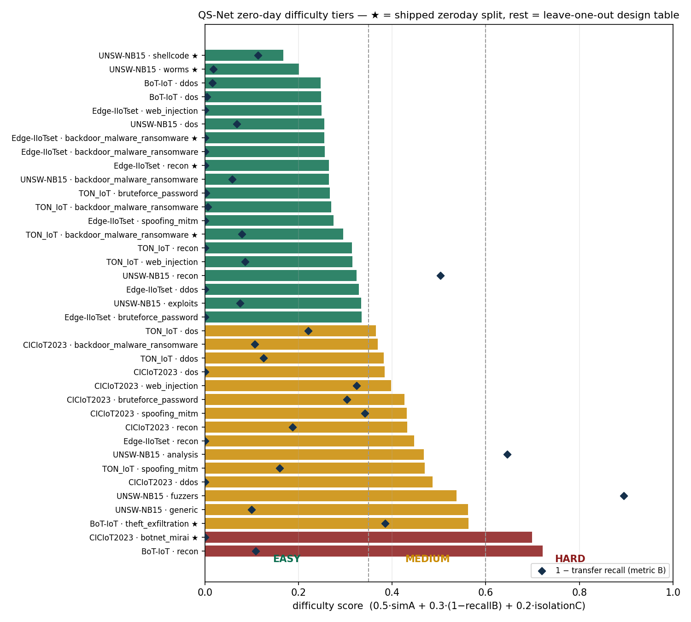

# Deliverable (Day 5) — Difficulty-Aware Zero-Day Benchmark & Similarity Analysis

**QS-Net / QuantumSentinel — Team A** · Week 1 · Day 5.
Task (`first 7 days task.pdf`): *develop a novel dataset curation strategy by creating
difficulty-aware zero-day splits (Easy, Medium, Hard) based on attack similarity and clustering →
difficulty-aware zero-day benchmark and similarity analysis.*
Implementation: [`scripts/zero_day_tiers.py`](../scripts/zero_day_tiers.py) (seed 42) ·
Figure: [`figures/zero_day_tiers.png`](figures/zero_day_tiers.png) ·
Machine-readable: `datasets/<name>/qadcp/zero_day_tiers.json` + `reports/_generated/zero_day_tiers.csv`.
Builds on the Day-4 QADCP outputs (`train.parquet` scaled feature space, `zeroday.parquet` holdouts).

## 1. Method — three metrics, one pre-registered score

"How hard is family X as a zero-day?" is answered with three *independent* measurements, blended
into one score, with tier thresholds **fixed before computing any result** (no post-hoc tuning):

| Metric | What it measures | How |
|---|---|---|
| **A — feature-space similarity** (weight 0.5, primary) | Is the family *far from* everything trained on? | 0.5 × (1 − k-NN overlap fraction vs train attacks) + 0.5 × nearest-centroid distance, normalized by the p95 of pairwise train-family centroid distances |
| **B — classifier transfer** (0.3, validation) | Does a real model actually miss it? | RandomForest attack-vs-benign trained **without** the family; 1 − detection recall on the family |
| **C — cluster isolation** (0.2, task-sheet "clustering") | Does it hide inside other families' clusters? | KMeans over all attack families; fraction of the family's rows *not* absorbed into clusters dominated by other families |

**Score** = 0.5·A + 0.3·(1−recall_B) + 0.2·C ∈ [0,1] · **Tiers:** Easy < 0.35 ≤ Medium < 0.60 ≤ Hard.
Two granularities: **holdout** (★ — the shipped `zeroday.parquet` families = the actual benchmark) and
**leave-one-out** (every trainable family with ≥50 train rows = the design table that Day 6 uses for
cross-dataset tiers, and that **BoT-IoT Theft joins automatically** once AK's raw-mode re-run lands).

## 2. The benchmark (holdout families, ★)

| Dataset | Zero-day family | Score | **Tier** | Transfer recall | Nearest trained family |
|---|---|---:|---|---:|---|
| CIC-IoT2023 | **botnet_mirai** (10,984 rows) | 0.699 | **Hard** | 1.000¹ | dos |
| TON_IoT | backdoor/ransomware (254) | 0.295 | **Easy** | 0.921 | bruteforce_password |
| Edge-IIoTset | backdoor/ransomware (9,692) | 0.255 | **Easy** | 1.000 | web_injection |
| Edge-IIoTset | recon/fingerprinting (856) | 0.265 | **Easy** | 1.000 | ddos |
| UNSW-NB15 | shellcode (1,449) | 0.168 | **Easy** | 0.886 | recon |
| UNSW-NB15 | worms (166) | 0.201 | **Easy** | 0.982 | exploits |
| BoT-IoT | **theft** (683) | 0.563 | **Medium** | 0.615 | recon² |

¹ Mirai is *binary-detectable* (it floods like DoS → recall 1.0) yet sits in an isolated feature
region (simA 1.0, isolation 0.99): a model *flags* it as attack but cannot *characterize* it —
exactly the "known-unknown" regime the Hard tier is meant to capture. Family-level (not binary)
zero-day evaluation is where this tier will bite.

## 3. Similarity analysis — what the leave-one-out table shows

Full table (36 rows: 30 leave-one-out + 6 holdout): `reports/_generated/zero_day_tiers.csv`. Headlines:

- **Hardest zero-days measured:** BoT-IoT **recon** (0.703 — in a dataset that is 99.98 % flood
  traffic, recon is structurally alien), CIC **botnet_mirai** (0.699), UNSW **generic** (0.562) and
  **fuzzers** (0.538 — transfer recall collapses to **0.105**, the worst in the study).
- **Metric A and B agree at the extremes but disagree instructively in the middle:** UNSW *fuzzers*
  (similarity moderate, recall 0.105) fails by *behavioral novelty*; BoT-IoT *recon* (similarity huge,
  recall 0.978) is *feature-isolated yet binary-detectable*. A blended score ranks both correctly;
  either metric alone would misrank one of them — this is the argument for the 3-metric design.
- **Dataset-level difficulty ordering** (mean LOO score): CIC-IoT2023 (0.42) > BoT-IoT (0.41) >
  UNSW-NB15 (0.39) > TON_IoT (0.34) > Edge-IIoTset (0.32) — Edge-IIoTset is the *easiest* zero-day
  environment (its attacks share protocol-field signatures), CIC the most diverse; BoT-IoT's high
  mean is driven entirely by its recon outlier (0.70) over only 3 scoreable families. Useful for Team B: report
  zero-day results **per tier**, never pooled.
- **DDoS↔DoS are mutual nearest neighbours in CIC-IoT2023 and BoT-IoT** — there they are effectively
  one family for zero-day purposes; holding out one while training the other is near-meaningless
  (BoT-IoT ddos/dos LOO scores identical at 0.256). In TON_IoT the pair does *not* collapse (ddos's
  nearest family is backdoor/ransomware, dos's is web_injection). The Day-6 ontology should treat
  "volumetric flood" as the unit of holdout where the pair collapses (CIC, BoT-IoT).

## 4. Interpretation rules for Team B

1. **Binary zero-day detection** (attack-vs-benign) is nearly saturated for Easy families
   (recall 0.89–1.0) — headline results must come from **Medium/Hard** tiers.
2. **Family-level identification** on Hard families (Mirai) is the open problem — binary recall 1.0
   but the model has never seen the family label. This is the QS-Net benchmark's novelty claim:
   *difficulty is defined by feature-space geometry, not by binary detectability.*
3. Report per-tier metrics: `recall@Easy / @Medium / @Hard`, macro-averaged.

## 5. Limitations
1. **Transfer recall (B) uses an RF probe** — a deliberate classical baseline; Team B's QML models
   may rank differently (that comparison is itself a Week-3+ result). Weights (0.5/0.3/0.2) are
   design choices, pre-registered; the CSV carries all three raw metrics so any re-weighting is a
   one-liner, and tier edges were **not** tuned to produce a desired distribution.
2. **Edge-IIoTset recall ≡ 1.0** across all LOO families: with 84 % attacks and protocol-field
   features, *any* anomaly is flagged — its Easy tiers are trustworthy, but recall carries no
   signal there (score is then dominated by A + C, which is the intended fallback).
3. **BoT-IoT Theft — resolved** (§6): AK's raw-mode re-run landed; Theft (683 rows) scores
   **Medium (0.563)** — the *only* Medium holdout in the shipped benchmark. As designed,
   `zero_day_tiers.py` needed zero changes (² marks the added row in §2).
4. Tiers are **within-dataset**; cross-dataset tiers (train Edge ransomware → test TON ransomware)
   require the Day-6 unified schema. The LOO table is the input to that step.

## Concerns & Recommendations
**Concern:** after AK's re-run (§6) the shipped benchmark is **1 Hard / 1 Medium / 5 Easy** — the
BoT-IoT Theft re-run supplied the first Medium holdout, but the tail is still Easy-heavy and would
overstate model readiness. **Recommendations:** (1) on Day 6, *promote* more high-LOO-score families
into the zeroday split where duplicates exist across datasets (e.g. hold out UNSW **fuzzers** (0.538)
and **generic** (0.562) → more Medium-tier coverage); (2) adopt the "volumetric flood" merge (§3) in
the Day-6 ontology so DDoS/DoS holdouts stop being trivially solvable; (3) Team B reports per-tier,
never pooled (§4); (4) **done** — tiers re-run after AK's raw-mode re-run: BoT-IoT Theft is now
scored (§6); TON ransomware is dedup-limited to 254 (no additional unique flows recoverable).

## 6. Update — BoT-IoT raw re-run landed (AK, 2026-07-07)

AK's rare-class raw re-run ([`08`](08_qadcp_design.md) §4², [`scripts/bot_raw_resample.py`](../scripts/bot_raw_resample.py))
recovered BoT-IoT's **Theft** family (683 unique vectors) and **Normal** (39→6,909), regenerating
BoT's feature space (15→16 features, q12→q16). Re-running `zero_day_tiers.py` scored it with **zero
code changes** (Theft was already the BoT zero-day holdout):

| BoT-IoT family | mode | score | tier | Δ vs pre-re-run |
|---|---|---:|---|---|
| **theft_exfiltration** (683) | **holdout ★** | **0.563** | **Medium** | new — was *pending* (empty) |
| recon | loo | 0.721 | Hard | 0.703 → 0.721 |
| dos | loo | 0.249 | Easy | 0.256 → 0.249 |
| ddos | loo | 0.247 | Easy | 0.256 → 0.247 |

- **Impact on the shipped benchmark (§2):** Theft is the **first and only Medium-tier holdout** → the
  benchmark moves from *5 Easy / 0 Medium / 1 Hard* to **5 Easy / 1 Medium / 1 Hard**, directly
  softening the skew flagged in *Concerns*. Theft is *feature-similar* to recon (simA 0.762) yet only
  *moderately* transfer-detectable (recall 0.615) and partly cluster-isolated (0.332) — a genuine
  middle-difficulty zero-day, not an artifact of the thresholds.
- **Marginal LOO shift:** BoT's mean LOO stays ≈0.41; recon stays the dataset's Hard outlier;
  ddos/dos remain mutual nearest-neighbours and near-identical (0.247/0.249, no longer *exactly*
  equal) — §3's volumetric-flood-merge argument is unchanged. The regenerated
  `reports/_generated/zero_day_tiers.csv` is authoritative for all BoT-IoT figures.
- **TON ransomware:** stays 254 — a true post-dedup unique-vector count; the raw re-run confirmed no
  additional unique ransomware flows exist to recover (so §2's TON row is unchanged).

---
*Reproduce:* `python week1/scripts/zero_day_tiers.py` (~1–2 min; sklearn 1.8 + scipy; seed 42) →
per-dataset `qadcp/zero_day_tiers.json`, `_generated/zero_day_tiers{.csv,_summary.json}` and
`figures/zero_day_tiers.png` in one run.*
