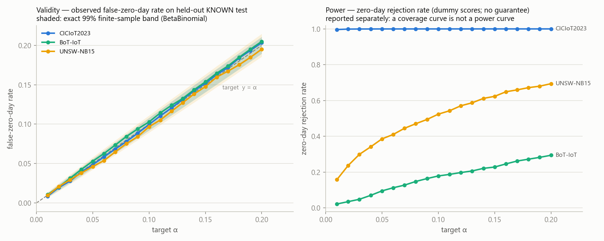

# Deliverable (Week 3 · Day 16) — Coverage-Verification Harness + α-Sweep

**QS-Net / QuantumSentinel — Team A** · Week 3 · Day 16.
Task (`qi26_12_week3.pdf`): *build the coverage-verification harness: empirical false-zero-day rate on a
held-out KNOWN set must be ≤ α; add α-sweep (0.01–0.20) to produce the headline coverage curve later.*
Implementation: [`scripts/coverage_harness.py`](../scripts/coverage_harness.py) (seed 42; imports the Day-15
conformal math from [`conformal_calibrate.py`](../scripts/conformal_calibrate.py) — one source of truth) ·
Figure: [`figures/w3_02_coverage_curve.png`](figures/w3_02_coverage_curve.png) ·
Machine-readable: `reports/_generated/w3_02_coverage_verification.json` + `w3_02_alpha_sweep.csv` ·
Tests: [`tests/test_coverage_harness.py`](../tests/test_coverage_harness.py) (9 cases).

## 1. Why "FZR ≤ α" alone is the wrong acceptance test

Split conformal guarantees the **expectation**: E[false-zero-day rate] ≤ α, marginally over the calibration
*and* test draws. On a finite test set the empirical rate fluctuates around (n+1−k)/(n+1), so a naive
`fzr ≤ α` assertion fails sound systems by luck — **Day 15 already produced the counterexample**: BoT-IoT
(dummy) at α = 0.05 shows FZR 0.0530 and trips the simple bound. The harness instead checks the observation
against the **exact finite-sample law** (continuous scores, exchangeability):

> coverage | calibration ∼ Beta(k, n+1−k)  ⟹  false-flag count E on m test rows ∼ **BetaBinomial(m, n+1−k, k)**
> (Vovk 2012, *Conditional validity of inductive conformal predictors*; Angelopoulos & Bates 2023, §3.2)

Per (dataset, α) the harness reports the observed FZR, the exact central 99% band for it, a one-sided tail
p-value P(E ≥ e_obs), and two verdicts: `expectation_ok` (the Day-15 continuity bound, kept for comparison)
and **`finite_sample_ok` (the harness verdict — FAIL means the guarantee is genuinely violated, not
unlucky)**. Below-band excursions are flagged as `conservative_note` (ties/discreteness), not failures.

## 2. Headline verification (α = 0.05, dummy interface)

| Dataset | n_cal | k | m_test | false flags | FZR observed | expected | exact 99% band | p(E ≥ obs) | naive bound | **verdict** |
|---|---:|---:|---:|---:|---:|---:|---|---:|---|---|
| CIC-IoT2023 | 18,883 | 17,940 | 18,883 | 918 | 0.0486 | 0.0500 | [0.0443, 0.0559] | 0.73 | ok | **PASS** |
| **BoT-IoT** | 18,591 | 17,663 | 18,591 | 986 | **0.0530** | 0.0500 | [0.0443, 0.0559] | **0.090** | **violated¹** | **PASS** |
| UNSW-NB15 | 10,112 | 9,608 | 10,086 | 467 | 0.0463 | 0.0499 | [0.0423, 0.0581] | 0.89 | ok | **PASS** |

¹ The Day-16 harness **formally resolves the Day-15 open item**: BoT's 0.0530 sits well inside the exact
band (p = 0.090 ≫ 0.005) — ordinary sampling noise on 18,591 test rows, exactly as AK's footnote suspected,
now with the theorem instead of the suspicion. No coverage violation anywhere.

## 3. α-sweep 0.01–0.20 (the coverage-curve scaffold)

20 α values × 3 datasets = **60 verifications, 60/60 PASS** on the finite-sample verdict
(`w3_02_alpha_sweep.csv`; at a 99% band ≈ 0.6 chance excursions were *expected* — observing 0 is consistent).
The observed FZR tracks the diagonal within the band across the whole range:

Left: **validity** — observed false-zero-day rate vs target α with the exact band (the paper's headline
coverage curve reads from this CSV). Right: **power** — zero-day rejection vs α, plotted separately because
a coverage curve is not a power curve; on the dummy interface power is a synthetic placeholder (CIC ≈ 1.0,
UNSW ≈ 0.4, BoT ≈ 0.1 — tracking the Day-9 diagnostic, *not* a claim about real prototypes).

## 4. Interpretation rules for Team B

1. **Validity is score-agnostic** — the band held on dummy scores and will hold on real prototypes *if
   calibration stays out-of-sample*; a FAIL after the swap means exchangeability got broken in the plumbing
   (e.g., prototypes fit on calibration rows), not that fidelity is a bad score.
2. **Power is the open empirical question** — the right-hand curve is the thing that changes when real
   MAQT prototypes land; rerun is one command: `coverage_harness.py --scores-root <real> --source real`.
3. **Day-18 extension is a flag, not code**: the harness already runs all three datasets; per-dataset
   coverage-vs-α tables for "coverage table v1" come straight from `w3_02_alpha_sweep.csv`.

## 5. Limitations

1. **Dummy scores** — every number above validates the *machinery*, not detection quality (Day-15 caveat
   inherited). 2. **Band assumes continuous scores** — heavy ties make `s > q` conservative; the harness
   reports (not fails) below-band excursions. 3. **Multiplicity across the sweep** — 60 band-tests at 99%
   are individually calibrated; family-wise control belongs to Day 17's Holm–Bonferroni layer, applied where
   claims are made. 4. **One seed** — the partitions are deterministic (seed 42); seed-sensitivity of
   *baseline metrics* is Day 13/17's harness, not the conformal band's.

## Concerns & Recommendations

**Concern:** with the dummy interface, a reader could mistake the saturated CIC power curve for a result.
**Recommendations:** (1) adopt `finite_sample_ok` as the **acceptance gate** for every coverage claim in the
paper (it is exact, one-sided, and auditable from the CSV); (2) when Team B's real CIC prototypes land,
re-run the identical command and re-publish the curve — validity should hold, power will change;
(3) keep the expectation bound in the outputs (cheap continuity with Day 15) but never gate on it;
(4) Day 18 should add the per-dataset achieved-FZR-vs-α table (columns already in the sweep CSV).

---
*Reproduce:* `python week3/scripts/coverage_harness.py` (~5 s; trio, α = 0.05 headline + 0.01–0.20 sweep +
figure) → `_generated/w3_02_coverage_verification.json`, `_generated/w3_02_alpha_sweep.csv`,
`figures/w3_02_coverage_curve.png`. Tests: `python -m pytest week3/tests/test_coverage_harness.py` (9).*
